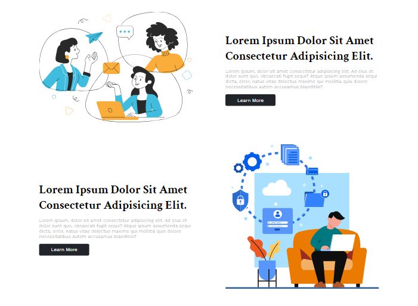
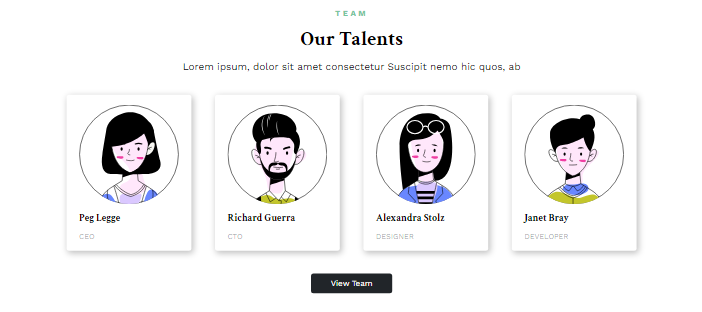

# modsen_test_task
kriiiska.github.io/modsen_test_task/

# Lorem Ipsum Dolor Sit Amet Consectetur

## Описание
Lorem Ipsum Dolor Sit Amet Consectetur - это современный адаптивный сайт, предназначенный для представления информации о партнерах, команде и другой важной информации. Сайт был разработан по макету для предоставления пользователям удобного интерфейса и доступности на различных устройствах.

## Структура проекта
- **Главная страница**:
  - **Header с меню**.
  - **Информация о партнерах**: секция, представляющая партнеров проекта.
  - **Две информационные секции**: содержат информацию о проекте.
  - **Информация о команде**: секция, представляющая членов команды.
  - **Footer с социальными сетями**: ссылки на социальные сети проекта.

## Технологии
- HTML
- CSS
- JavaScript

## Сайт полностью адаптивен и может использоваться на различных устройствах.

## Скриншоты

